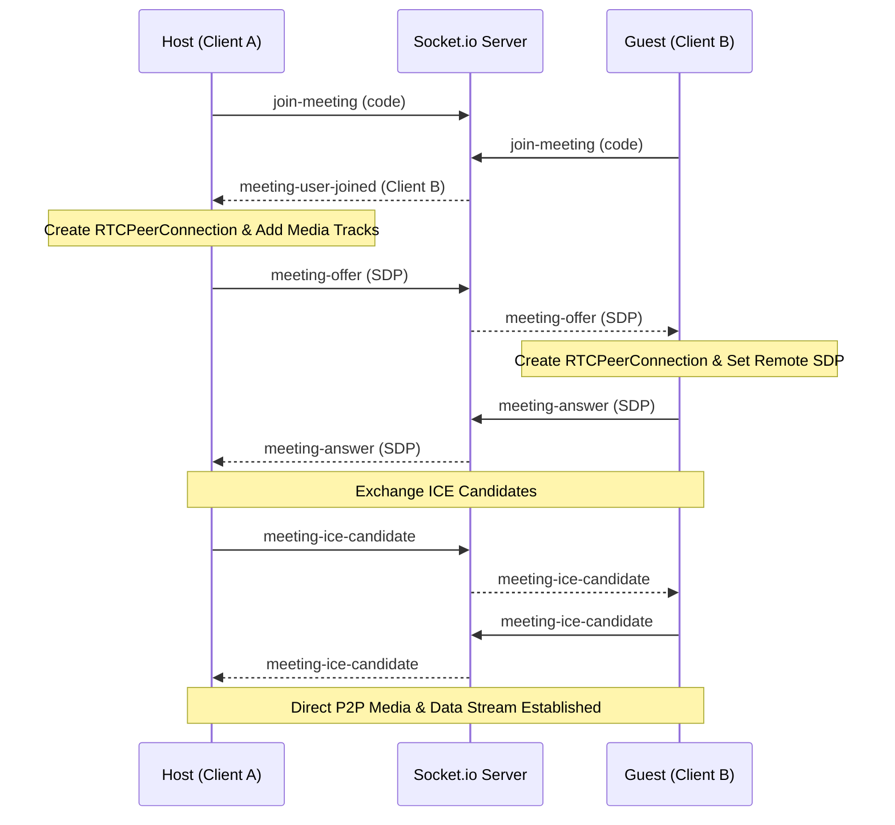
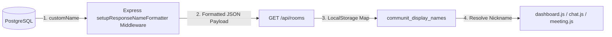
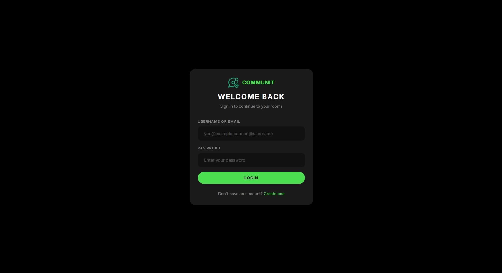
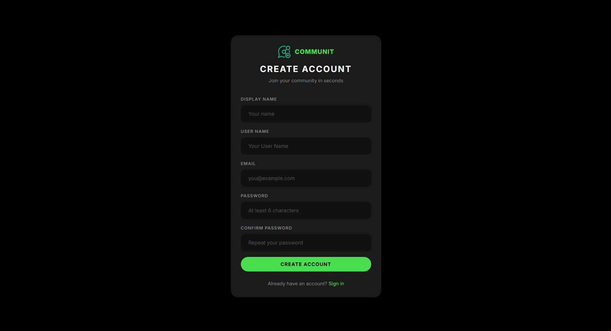
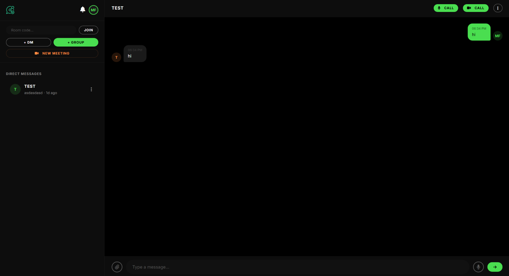
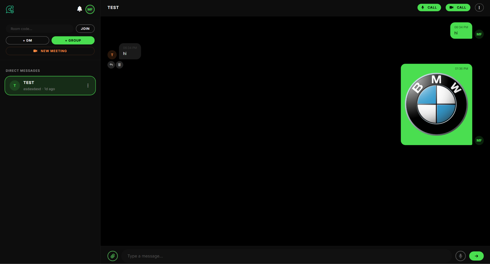
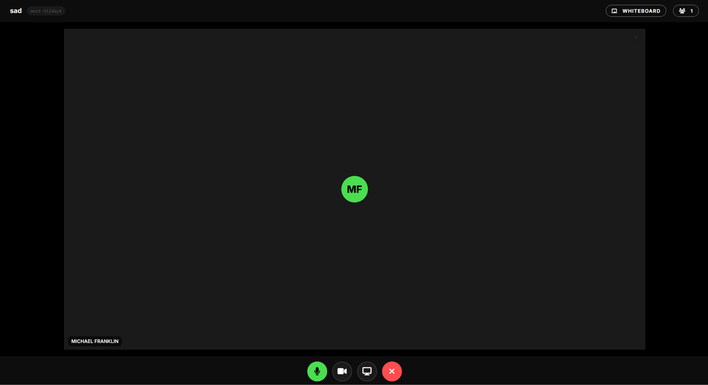
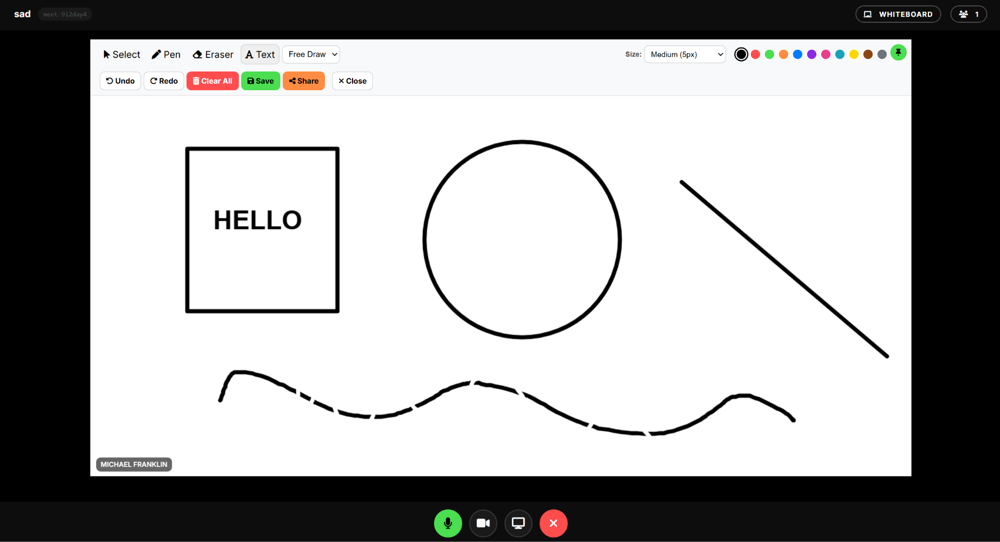

# Communit — Real-Time Collaboration Ecosystem

**Communit** is a high-performance, real-time communication platform designed to enable seamless collaboration directly from your web browser. Built on a clean monolithic architecture, Communit provides secure instant messaging, rich text formatting, voice recordings with waveforms, documents and media transfer, direct WebRTC audio calling with a Picture-in-Picture overlay, full-screen video meetings, screen sharing, real-time screen annotations, and a collaborative vector whiteboard.

---

## 🚀 Key Features & Capabilities

### 1. Unified Real-Time Messaging (DMs & Groups)
* **Direct Messages (DMs):** Fast peer-to-peer messaging. Autocomplete suggestions help you locate registered contacts immediately.
* **Group Chats:** Create multi-member groups with custom names. Group creators act as hosts with privileges to manage participants (add or remove members).
* **Context-Driven Actions:** A persistent three-dots options menu on all chat items (both DMs & Groups) across all screens allows you to:
  * **Pin / Unpin** chats to lock crucial conversations at the top of your sidebar.
  * **Clear Chat** history (deletes messages locally and remotely for all participants).
  * **Block / Unblock** users in DMs to halt communications.
  * **Leave Group** for standard members.
  * **Delete Group / Room** (restricted to hosts).
  * **Rename Contact (Edit Name):** Assign custom nicknames or aliases to other users.
* **Typing Indicators:** Real-time visibility when a peer is actively typing.
* **System Messages:** Automated in-chat alerts when a user joins or leaves a room.
* **Notifications & Toast Alerts:**
  * Real-time toast banners alert you to incoming messages with preview text (capped at 10 consecutive alerts to prevent overload).
  * An interactive notification bell dropdown records meeting invites in real-time, labeling them as *Ongoing* or *Ended*.

### 2. Rich Messaging Tools
* **Voice Messages:** Record voice clips with an inline timer, send/cancel options, and an interactive waveform display during playback.
* **File & Image Attachments:** Send images, videos, audio tracks, archives (Zip, Tar), and documents (PDF, Word, Excel, PowerPoint, Plain Text). Matching line-art icons and download shortcuts render automatically.
* **Swipe-to-Reply (Touch Devices):** Swipe any message bubble horizontally on mobile or touch viewports to trigger a nested reply.
* **Message Actions:** Edit or delete sent messages with real-time socket-based DOM updates.

### 3. Real-Time Audio Calling (PiP-Enabled)
* **Active Call Overlay:** Connect instantly with peer-to-peer WebRTC audio. The overlay indicates participants' initials and real-time mute states.
* **Picture-in-Picture (PiP) Widget:** Minimize the active call window into a compact, draggable overlay containing a call duration counter, current speaker indicators, mute/unmute toggles, and hang-up controls.

### 4. Full-Screen Video Meetings
* **WebRTC Mesh Signaling:** Fully decentralized peer-to-peer audio, video, and screen-sharing transmission.
* **Interactive Toolbars:** Real-time toggles for microphone mute, camera visibility, and screen sharing.
* **Participant Sidebar:** View and manage participants, kick members (host only), and invite new users.
* **Collaborative Screen Annotations:** Draw lines, boxes, circles, or write text directly on top of the presenter's shared screen.
* **Collaborative Whiteboard:** A shared canvas featuring:
  * Drawing brushes with adjustable thickness and pre-selected colors.
  * Shape tools (Line, Rectangle, Circle).
  * Text insertion.
  * Selector tool (lasso bounding box) to translate and move elements dynamically.
  * Multi-step Undo/Redo queues.
  * Eraser tool and full canvas clear (clear board restricted to host).

### 5. Multi-Device Layout Optimizations
* **Compact Header Icons:** Text descriptions are hidden on mobile viewports (`<= 768px`) for header actions, using only FontAwesome icons.
* **Unpinned Video Grid Carousel:** If no participant is pinned on screens `<= 768px` and the tile count exceeds 4, the video grid layout transitions into a horizontal swipe-to-scroll 2x2 grid (max 4 per screen).
* **Hidable Whiteboard Toolbar:** Toggle and collapse toolbars on mobile screen layouts to maximize drawing space.
* **Input Box Overflow Prevention:** Sized with dynamic constraints to prevent send buttons and media triggers from shifting off-screen.


---

## 🧩 Component Architecture

The application is built using a clean separation of concerns across standard web technologies (HTML, CSS, client-side JS modules, backend Node.js services, a relational database, and WebSocket signaling):

### 1. HTML (HyperText Markup Language) Viewports
* **Landing Page (`index.html`):** The introduction page detailing application features with navigation routing options to login or register.
* **Authentication Suite (`login.html` & `register.html`):** Renders entry forms for sign-in and account registration. Interfaces with the backend authorization API and caches session keys (JWT) inside browser storage.
* **Main Collaboration Hub (`dashboard.html`):** The central workbench of the application. Renders the active rooms sidebar, real-time message stream panel, active call actions, profile management settings, and contact directories.
* **Video Meeting Room (`meeting.html`):** A distraction-free full-screen page for WebRTC mesh meetings. Integrates peer video cards, presenters' screen-share boxes, the whiteboard drawer, and real-time screen overlay annotations.

### 2. Vanilla CSS (Styling & Layout Engine)
* **Design System (`public/css/styles.css`):** Handles all visual styling, layout, variables, responsive design, and animations.
* **Responsive Flexbox/Grid Systems:** Adapts the platform layout from wide desktop displays to compact smartphones.
* **Meeting Video Carousel:** Custom CSS rules that format meeting grids, enabling swipe-snapping for 2x2 grids on mobile screens.
* **Whiteboard & Toolbars Layouts:** Handles sliding overlays and hides tools on mobile viewports to maximize workspace.

### 3. Client-Side JavaScript Components & Widgets
* **Navigation & Sidebar Controller (`dashboard.js` & `auth.js`):** Manages user session state, loads user profiles, updates notification logs, queries search databases with auto-suggestions, and lists active rooms with custom contact name resolvers.
* **Chat Window & Attachment Manager (`chat.js`):** Coordinates text message delivery, edit/delete actions, inline voice notes recording timers, audio waveforms visualization, file uploads rendering, and mobile swipe-to-reply events.
* **Draggable Audio Call Widget (`audio-call.js`):** Minimizes standard audio calls into a persistent, draggable floating Picture-in-Picture (PiP) card showing call timers, speaker states, and quick-mute tools.
* **WebRTC Meeting Engine (`meeting.js` & `webrtc.js`):** Handles multi-peer mesh signaling. Connects audio/video feeds, handles screen sharing, controls layout transitions, and supports viewport video grid configurations on mobile.
* **Collaborative Vector Whiteboard (`whiteboard.js`):** Provides a synchronized canvas drawing area with brush attributes, vector shapes, text elements, lasso movements (select and drag), and undo/redo stacks.
* **Overlay Annotator (`annotation.js`):** Spawns a transparent annotation canvas over screen-shared media, transmitting pointer lines and shapes to participants in real-time.

### 4. Backend Server Services (Node.js & Express)
* **Authentication Router (`src/routes/auth.js`):** Controls account registration, token validation, security credentials modification, and account deletions.
* **Response Name Formatter Middleware (`src/middleware/nameFormatter.js`):** A custom database-to-API formatter. Intercepts outgoing database models to override user display names with custom contact nicknames or formats them as first-name-only fallback displays.
* **Room & Chat Router (`src/routes/rooms.js` & `src/routes/files.js`):** Resolves room messages logs, file uploads routing via Multer, member removals, room deletions, and contact nicknames database records.
* **Meeting Manager (`src/routes/meetings.js`):** Issues distinct meeting pins/codes, authorizes access lists, and tracks online meeting invites.

### 5. Real-Time WebSockets (Socket.io)
* **Real-time Event Handlers (`src/handlers/chat.js`):** Routes low-latency socket payloads for message typing statuses, notifications, WebRTC handshake signaling (SDP/ICE), active call rings, and canvas whiteboard draw events.

### 6. Database Models & Schema (PostgreSQL & Prisma ORM)
* **Database Schema (`prisma/schema.prisma`):** Contains entity definitions for:
  * `User` & `UserSession` (Identity & Session keys).
  * `Room` & `RoomParticipant` (DM & Group relations, blocks, pins, and custom nicknames).
  * `Message` (Text content, files attachments, voice notes data, replies, edit indicators).
  * `ContactLink` (Contacts mapping with nickname overrides).
  * `Meeting` & `MeetingInvite` (Meeting status codes, guest queues, unseen alerts).

---

## 🛠️ Technology Stack

* **Backend Server:** Node.js, Express, Cors, Multer
* **Real-time Pipeline:** Socket.io (WebSockets)
* **Database & ORM:** PostgreSQL database, Prisma ORM Client
* **Authentication:** JSON Web Tokens (JWT) & LocalStorage state caching
* **Media Protocol:** Native WebRTC Mesh (`RTCPeerConnection` & `RTCDataChannel`)
* **Frontend UI:** HTML5 Semantic Structure, Vanilla CSS, JavaScript ES Modules, FontAwesome v6 line-art CDN

---

## 📊 System Architecture & Diagrams

### 1. High-Level System Architecture

```mermaid
graph TD
    Client1[Client A (Browser)] <-->|Signaling / Socket.io| Backend[Node.js Express Backend]
    Client2[Client B (Browser)] <-->|Signaling / Socket.io| Backend
    Backend <-->|Prisma ORM| DB[(PostgreSQL Database)]
    Client1 <-->|P2P WebRTC Media Stream| Client2
    Client1 <-->|P2P WebRTC DataChannel| Client2
```

### 2. WebRTC Peer Handshake (Mesh)



### 3. Contact Nickname Resolution Pipeline



---

## 📖 How to Use Communit

### 1. Register & Login
1. Navigate to the login page. If you do not have an account, click **Register**.
2. Fill in your name, unique username, email, and password to create an account.
3. Upon login, your session is authenticated via JWT, which is cached in your browser.

### 2. Add Contacts & Chat
1. Create a DM by clicking **+ DM** in the sidebar. Input a username (autocompletion suggestion guides your selection).
2. Create a Group by clicking **+ GROUP**. Select contacts from your DMs checklist and input a group name.
3. Double-click or tap a chat list item to select it. The chat box will open in the active panel.
4. Input text, attach files, record voice messages, or click the dots button to clear messages, leave, pin, or block.

### 3. Customize Names (Aliases)
1. Click the **3-dots options menu** next to any contact's name in your chat sidebar.
2. Select **Edit Name** from the dropdown menu.
3. Input the preferred alias/nickname for this contact.
4. Click save. The contact's name will update immediately across the dashboard, meeting viewports, and headers.

### 4. Audio Calls
1. Inside any active room header, click the **Audio Call** button. 
2. Accept incoming calls from the green answer modal, or decline them.
3. Collapse the call overlay into the Picture-in-Picture (PiP) widget by clicking the minimize icon.

### 5. Video Meetings
1. Start a meeting by clicking **📹 NEW MEETING** in the sidebar, or click the **Video Meeting** button in a group/DM header.
2. Share the generated room code with contacts. They will receive invitation alerts instantly in their notification dropdown bell.
3. Click the sidebar button to view participants. If you are the host, you can kick members or end the meeting.
4. Draw annotations directly on a shared screen, or toggle the whiteboard canvas to draft diagrams collaboratively.

### 6. Collaborative whiteboard
1. Inside an active video meeting room, click the **Whiteboard** button.
2. Select standard brush tools, shapes (line, box, circle), or write text.
3. Switch to the **Selector (Lasso)** tool to drag and move elements.
4. Use the undo/redo triggers to rollback mistakes.

---

## ⚙️ Development Setup & Installation

### 1. Prerequisites
* **Node.js** (v20.x or higher)
* **NPM** (v10.x or higher)
* **PostgreSQL** database instance

### 2. Install Dependencies
Clone the repository, navigate into the project root, and install the modules:
```bash
git clone <your-repository-url>
cd communit
npm install
```

### 3. Environment Configuration
Create a `.env` file in the root of the project:
```env
PORT=3000
DATABASE_URL="postgresql://<username>:<password>@<host>:5432/<database_name>?schema=public"
JWT_SECRET="your-super-secret-key"
```

### 4. Database Setup
Push the schema to your PostgreSQL database and generate the Prisma client:
```bash
npx prisma db push
npx prisma generate
```

### 5. Run the Server
Start the development server:
```bash
npm run dev
```
Open `http://localhost:3000` in your web browser.

---

## 🌐 Ubuntu Server Production Deployment

For step-by-step production hosting with Nginx, PostgreSQL, PM2 Process Manager, SSL Certificates (HTTPS via Let's Encrypt), and UFW firewall configuration, refer to the [Ubuntu Server Deployment Guide](ubuntu_deployment_guide.md).

---

## 🖼️ Interface Gallery

Here are the visual representations of Communit's major features:

### 1. User Authentication
* **Sign-In Viewport:**
  
* **Registration & Sign-Up:**
  

### 2. Main Collaboration Hub (Messaging Dashboard)
* **Real-Time Workspace (DMs, Group list, & options triggers):**
  
* **Rich Messaging & Attachments (File uploads & inline players):**
  

### 3. Audio & Video Communication
* **Active WebRTC Video Meeting:**
  

### 4. Collaborative Vector Whiteboard
* **Multi-user Shared Sketchpad (Drawing toolbars, brush scales, shapes, lasso selections, & actions):**
  
